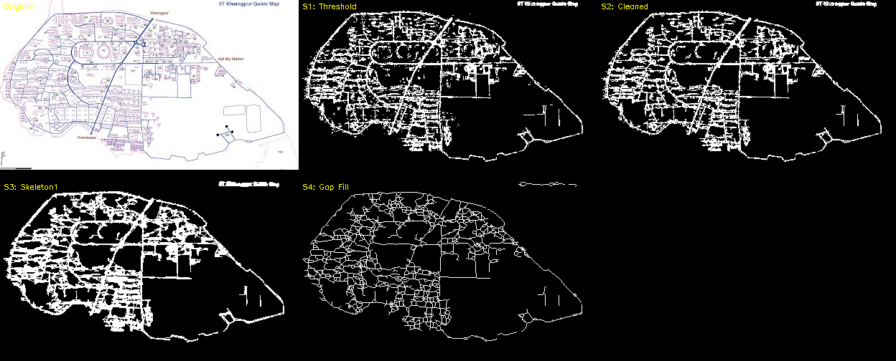
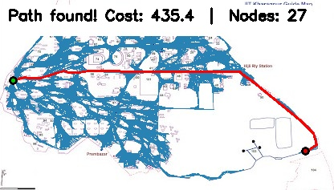
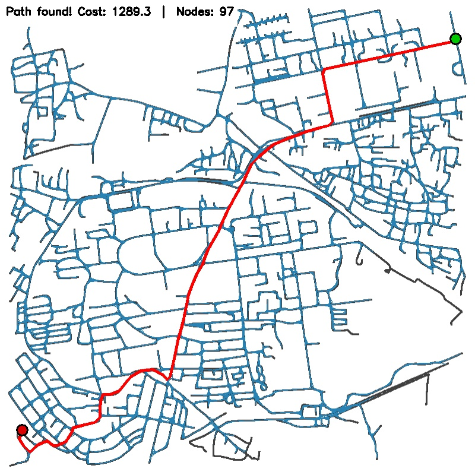

# Computer Vision — TRS Winter School

This repository contains solutions for the TRS Winter School Computer Vision tasks: **RRT\* path planning** on the IIT Kharagpur campus map and **background removal** via K-Means clustering, along with a bonus gesture-controlled Tetris game.

---

## Task 1: RRT* Path Planning

Finds optimal paths on the IIT Kharagpur campus road network using the **RRT\* (Rapidly-exploring Random Tree Star)** algorithm. Includes two demos:

- **Processing Demo** — extracts roads from a real campus map image through a 5-stage pipeline (HSV thresholding → component removal → Gaussian denoising → HoughLinesP gap filling → skeletonization), then plans a path on the resulting 1px-wide skeleton mask.
- **OpenStreetMap Demo** — downloads the campus road network via OSMnx, renders it as a binary mask, and runs the same RRT\* planner.

### Road Extraction Pipeline



### RRT* Path Result

<p align="center">
  
  
</p>
<p align="center"><em>Left: Processing demo &nbsp;|&nbsp; Right: OpenStreetMap demo</em></p>

### Quick Start

```bash
# Processing demo (road extraction from image + RRT*)
cd task1/processing_demo
python run.py

# OpenStreetMap demo (downloads OSM data on first run)
cd task1/rrt_demo
python run.py
```

See [`task1/README.md`](task1/README.md) for full details on the algorithm and design decisions.

---

## Task 2: Background Removal via K-Means Clustering

Segments an image using **K-Means clustering** in CIE LAB color space, identifies the background via a border-dominance heuristic, and composites the foreground onto a replacement background with Gaussian-feathered alpha blending.

### Results


### Quick Start

```bash
cd task2
python kmeans_bg_removal.py
```

See [`task2/README.md`](task2/README.md) for approach details and configuration.

---

## Bonus: Gesture-Controlled Tetris

A fully playable Tetris game rendered with OpenCV and controlled via real-time hand gestures using MediaPipe:

| Gesture | Action |
|---------|--------|
| Pinch left/right | Move piece |
| Thumbs up | Rotate |
| Closed fist | Hard drop |

```bash
cd bonus_task
python bonustask.py
```

---

## Dependencies

```bash
pip install opencv-python numpy scipy scikit-image osmnx networkx matplotlib pillow mediapipe
```

- **Python 3.10+**
- `osmnx` is only required for the OpenStreetMap demo
- `mediapipe` is only required for the bonus Tetris task

## Project Structure

```
├── task1/
│   ├── rrt_star.py                 # Unified RRT* planner
│   ├── processing_demo/            # Real image → road extraction → RRT*
│   │   ├── preprocess.py           # 5-stage preprocessing pipeline
│   │   └── run.py
│   └── rrt_demo/                   # OpenStreetMap → skeleton → RRT*
│       ├── osm_map.py
│       └── run.py
├── task2/
│   └── kmeans_bg_removal.py        # K-Means background removal
├── bonus_task/
│   └── bonustask.py                # Gesture-controlled Tetris
└── documentation.pdf               # Full project report
```
